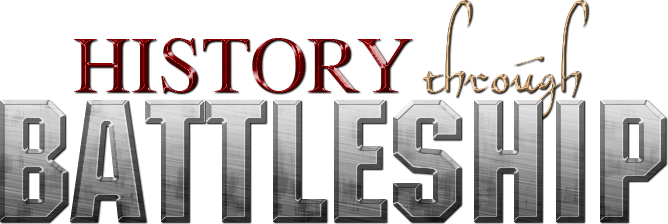
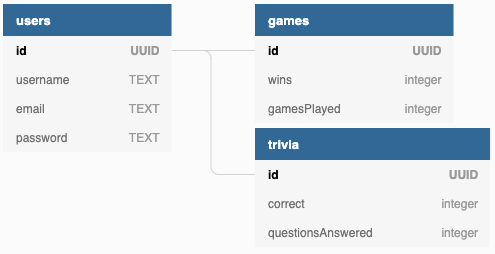
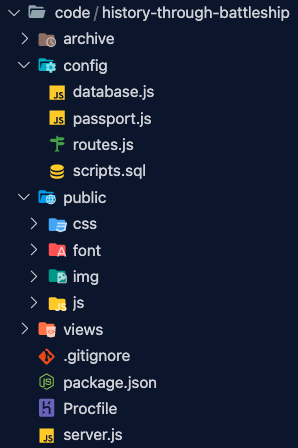

## Group 113-5
## Semester Project for CSCI 3308 - Software Development Methods

[Heroku App](https://history-through-battleship.herokuapp.com/)

### Team Members
* Salvatore Pacifico
* David Crockett
* Matthew Ruiz Diaz
* Andres Montealegre
* Kai Schuyler Gonzalez 

### Project Description
History Through Battleship is an educational web-game developed to test and refine students’ history skills. The application, which features both single player and local multiplayer, runs similarly to your typical battleship game. However, the game has a fresh educational twist that is meant to offer practical use. When launching a missile, a user must successfully answer a trivia question. If the user incorrectly answers their question, they lose their turn. 

Within the single player game mode, the user plays against an intelligent AI system that can launch missiles based on previous hits/misses. This competitive system can be a hard match for even the smartest history buff. The local multiplayer mode is played between two users on the same system. Once player 1 has placed his/her ships, they pass their turn to player 2 who will do the same. When both players’ ships have been placed, they can start the game. The users will then alternate turns by clicking the “End Turn” button at the bottom of the screen.

On the backend, History through Battleship utilizes a database to keep track of user’s usernames, passwords, and stats. This database is updated as new users register. Similarly, users stats are updated as trivia questions are answered correctly and incorrectly. Furthermore, History Through Battleship connects to the Trivia DB API and retrieves the trivia questions seen within the game. These questions could be changed to other subjects as well. 

### App Info
* We are using Heroku to deploy a node.js app.
* NPM Packages used:
  * Express with EJS
  * Passport
  * Node-Postgres
  * Bcrypt
  * UUID
* Postgres Database setup:

* App structure:

    
    * `server.js`: gateway to express js app. Dependencies and middlewares are setup here.
    * `config/database.js`: The connection to the Postgres database is setup here
    * `config/passport.js`: Our authentication strategies are setup here for the passport package
    * `config/routes.js`: Routes for our application are setup.
    * `scripts.sql`: This is how we setup our Postgres tables
    * `public/`: This is where all the public resources (images, stylesheets, font, and front-end javascript are here)
    * `views/`: EJS templates for our pages live here

### Running Locally in MacOS and Linux
1. Clone the repository
1. Make sure you have the [Heroku CLI](https://devcenter.heroku.com/articles/heroku-cli) installed
1. run `./build.sh` (you might have to use `chmod +x build.sh` if prompted)
1. Enter the postgres database url provided in the canvas submission when prompted
1. It will prompt you asking what you want to do, `Develop` runs the app in nodemon and adds the heroku remote for deployment, `Run Locally` just runs the app in localhost
1. For `Develop`:
    * Make your changes. 
    * In the `history-through-battleship` folder, follow these steps:
    * Find out what branch you're on ( your branch is the starred one)

            $ git branch
    * Checkout to the master branch and merge your changes

            $ git checkout master
            $ git merge <your branch>

    * Commit your changes

            $ git add .
            $ git commit -m 'commit message'
            $ git push heroku master

        * NOTE: before pushing to heroku, make sure the app will work in the heroku environment by running `heroku local web`
